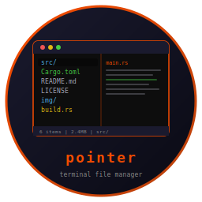
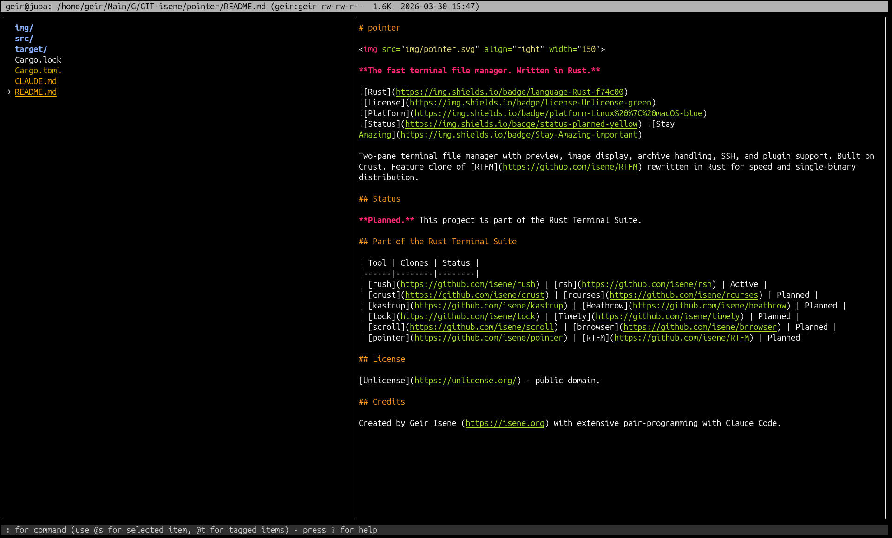
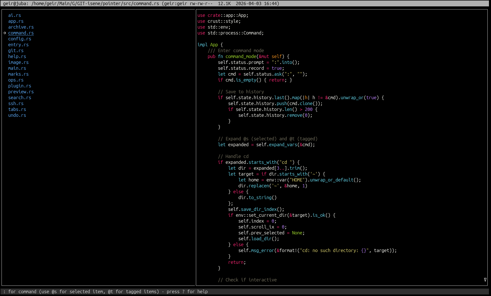
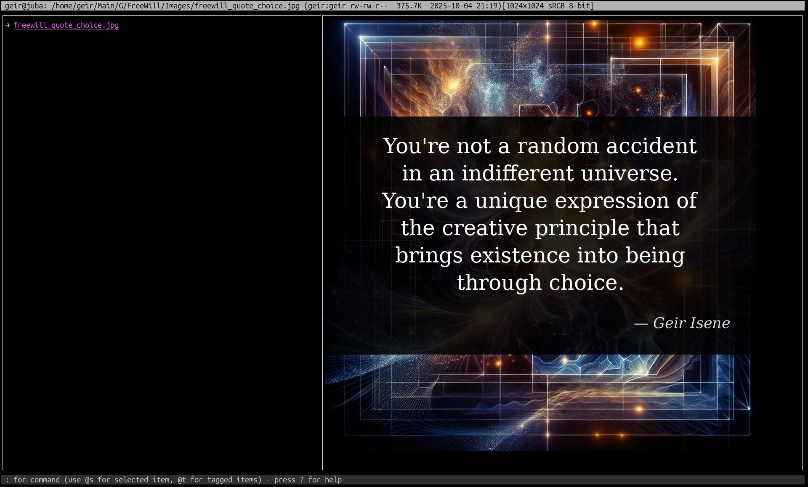
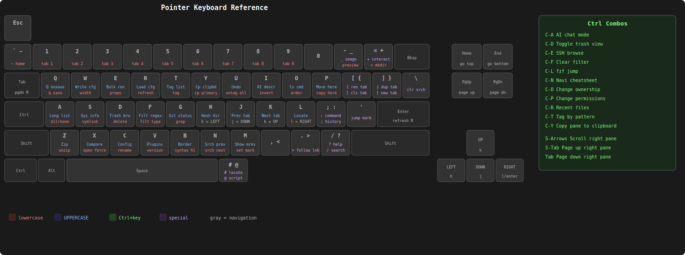

# Pointer - Terminal File Manager



   

A fast, feature-rich terminal file manager written in Rust. Two-pane layout with syntax-highlighted previews, inline image display, archive browsing, SSH remote access, async file operations, OpenAI integration, and comprehensive undo. Feature clone of [RTFM](https://github.com/isene/RTFM).

Built on [crust](https://github.com/isene/crust) (TUI) and [glow](https://github.com/isene/glow) (images). Single binary, ~3.6MB, ~50ms startup.

<br clear="left"/>

## Quick Start

```bash
# Download from releases (Linux/macOS, x86_64/aarch64)
# Or build from source:
git clone https://github.com/isene/pointer
cd pointer
cargo build --release

# Run
./target/release/pointer

# Start in specific directory
pointer ~/Documents

# Use as file picker
pointer --pick=/tmp/selected.txt

# Start with a clean slate (don't restore cursor positions)
pointer --fresh
```

Press `?` for built-in help. Press `q` to quit (saves state).

---

## Screenshots

| Directory browsing | File preview with bat |
|:---:|:---:|
|  |  |
| **Image preview** | |
|  | |

---

## Key Features

- **Two-pane layout** with configurable width ratio and border styles
- **LS_COLORS support** for consistent terminal theming
- **Syntax highlighting** built-in (20+ languages, plus dedicated Markdown/LaTeX/plaintext renderers with URL/TODO detection) with 6 themes, bat as optional toggle
- **Image preview** via kitty/sixel/w3m protocols (using glow)
- **Archive browsing** (zip, tar, gz, bz2, xz, rar, 7z as virtual directories)
- **SSH/SFTP remote browsing** (Ctrl-E)
- **Async file operations** with progress for large copy/move
- **Comprehensive undo** (delete, move, rename, copy, symlink, permissions, bulk rename)
- **Trash system** with toggle and browser
- **Tab management** (create, close, switch, duplicate, rename)
- **Bookmarks** with instant single-key jump
- **Search** (filename), **grep** (content), **filter** (extension/regex)
- **fzf** and **navi** integration
- **locate** with jump-to-result
- **Bulk rename** (regex, case conversion, extension change, prefix/suffix)
- **File comparison** (diff between two tagged files)
- **Git status** display
- **Directory hashing** (SHA1 change detection)
- **OpenAI integration** (file description, interactive chat)
- **Plugin system** (JSON manifests, external commands)
- **Script evaluator** (`@` mode with full context via env vars)
- **Top bar color matching** (path-based, like RTFM's @topmatch)
- **File picker mode** (`--pick=/path` for external tool integration)
- **Scrolloff** (3-line margin) and **wrap-around** navigation

## Keyboard Reference



### Quick Reference

| Key | Action | Key | Action |
|-----|--------|-----|--------|
| **Navigation** | | **View** | |
| j/k | Move down/up | a | Toggle hidden files |
| h/l | Go up / enter | A | Toggle long format |
| PgDn/PgUp | Page down/up | o | Cycle sort mode |
| HOME/END | First/last | i | Invert sort |
| ~ | Home directory | - | Toggle preview |
| ' | Jump to mark | _ | Toggle images |
| > | Follow symlink | b | Toggle bat/internal syntax |
| **Tags** | | **Search** | |
| t | Tag/untag | / | Search filenames |
| T | Show tagged | n/N | Next/prev match |
| u | Clear tags | \\ | Clear search & filter |
| Ctrl-T | Tag by pattern | f/F | Filter ext/regex |
| | | g | Grep file contents |
| | | Ctrl-F | fzf fuzzy finder |
| **File Ops** | | **Tabs** | |
| p | Copy here | ] / [ | New / close tab |
| P | Move here | J/K | Prev/next tab |
| d | Delete | 1-9 | Switch to tab |
| c | Rename | { / } | Rename / duplicate |
| s | Create symlink | **Command** | |
| = | Create directory | : | Shell command |
| E | Bulk rename | ; | Command history |
| X | Compare (2 tagged) | @ | Script evaluator |
| U | Undo | + | Add to interactive |
| **Marks** | | **UI** | |
| m | Set mark | w/W | Pane width fwd/back |
| M | Show marks | Ctrl-B | Cycle border |
| r | Recent files/dirs | C | Preferences editor |
| **Clipboard** | | **Info** | |
| y | Yank to primary | e | File properties |
| Y | Yank to clipboard | G | Git status |
| Ctrl-Y | Copy right pane | H | Hash directory |
| | | S | System info |
| Ctrl-L/Ctrl-R | Redraw/Refresh | I | AI describe |

### Right Pane Scrolling

| Key | Action |
|-----|--------|
| Shift-Down/Up | Scroll line |
| TAB / Shift-TAB | Page down/up |
| ENTER | Refresh preview |

## Configuration

Config: `~/.pointer/conf.json` (auto-created on first run)
State: `~/.pointer/state.json` (marks, history, recent files)
Trash: `~/.pointer/trash/`
Plugins: `~/.pointer/plugins/`

### Config Options

```json
{
  "width": 4,
  "border": 2,
  "preview": true,
  "trash": true,
  "bat": true,
  "show_hidden": false,
  "long_format": false,
  "sort_mode": "name",
  "sort_invert": false,
  "interactive": ["vim", "less", "top", "htop", "fzf", "navi"],
  "c_top_fg": 0, "c_top_bg": 249,
  "c_status_fg": 252, "c_status_bg": 236,
  "topmatch": [["PassionFruit", 171], ["Dualog", 72], ["", 249]],
  "ai_key": "",
  "ai_model": "gpt-4o-mini",
  "syntax_theme": "monokai",
  "remember_positions": true
}
```

`remember_positions` (default `true`) persists the cursor position per directory across sessions. Toggle at runtime with `r` in the `C` config screen, or launch with `pointer --fresh` to bypass restoration for a single session.

### Script Evaluator (@)

Press `@` to run a shell command with pointer context as environment variables:

| Variable | Content |
|----------|---------|
| `POINTER_SELECTED` | Full path of selected item |
| `POINTER_DIR` | Current working directory |
| `POINTER_TAGGED` | Newline-separated tagged paths |
| `POINTER_INDEX` | Selected index (0-based) |
| `POINTER_COUNT` | Number of files |
| `POINTER_CONTEXT` | JSON with all above |

Scripts can control pointer via stderr directives: `cd:/path`, `select:filename`, `status:message`.

### Plugin System

Plugins live in `~/.pointer/plugins/`. Each plugin is a JSON manifest (`.json` file) describing an external command bound to a key.

**Manifest format:**

```json
{
  "name": "Git",
  "description": "Interactive git client",
  "key": "C-G",
  "command": "bash ~/.pointer/plugins/git.sh",
  "interactive": true
}
```

| Field | Description |
|-------|-------------|
| `name` | Display name shown in help |
| `description` | Short description |
| `key` | Trigger key (e.g. `F5`, `C-G` for Ctrl-G) |
| `command` | Shell command to execute |
| `interactive` | If `true`, runs in raw terminal (full TUI). Default: `false` |

**Non-interactive** plugins run in the background; their stdout appears in the right pane. **Interactive** plugins take over the terminal (like vim or lazygit) and pointer restores its screen on exit.

Commands receive `POINTER_CONTEXT` env var with JSON state. Unmatched keys fall through to plugin dispatch, so plugins can bind any free key.

## Part of the Rust Terminal Suite (Fe2O3)

| Tool | Clones | Type |
|------|--------|------|
| [rush](https://github.com/isene/rush) | [rsh](https://github.com/isene/rsh) | Shell |
| [crust](https://github.com/isene/crust) | [rcurses](https://github.com/isene/rcurses) | TUI library |
| [glow](https://github.com/isene/glow) | [termpix](https://github.com/isene/termpix) | Image display |
| **[pointer](https://github.com/isene/pointer)** | **[RTFM](https://github.com/isene/RTFM)** | **File manager** |
| [kastrup](https://github.com/isene/kastrup) | [Heathrow](https://github.com/isene/heathrow) | Messaging |
| [tock](https://github.com/isene/tock) | [Timely](https://github.com/isene/timely) | Calendar |
| [scroll](https://github.com/isene/scroll) | [brrowser](https://github.com/isene/brrowser) | Browser |

## Dependencies

**Build**: Rust toolchain (cargo)

**Runtime** (optional, for full features):
- `bat` or `batcat` for external syntax highlighting (optional, built-in highlighter is default)
- `fzf` for fuzzy finding
- `ImageMagick` (`convert`, `identify`) for image preview
- `pdftotext` for PDF preview
- `git` for git status
- `xclip` for clipboard (also uses OSC 52)
- `locate` for file search
- `navi` for cheatsheets
- `curl` for AI integration

## License

[Unlicense](https://unlicense.org/) - public domain.

## Credits

Created by Geir Isene (https://isene.org) with extensive pair-programming with Claude Code.
